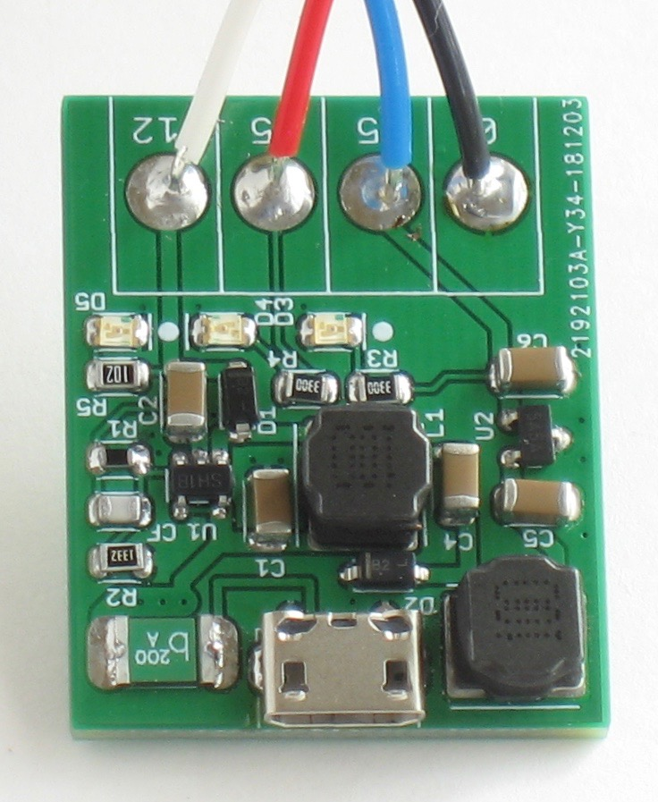

# USB powered Radio-86RK (even from a power bank!)

Compact DC/DC converter to power i8080 and other vintage NMOS ICs from USB.

Intel i8080 CPU, MK4116 DRAM, NTE2708 EPROM and similar NMOS ICs from 1970s require three power supply voltages: +12V, -5V and +5V.

This project is a compact DC/DC converter that converts +5V from USB connector to +12V and -5V. This allows powering a retro computer, such as the [Radio-86RK](https://github.com/mac2rk/Radio-86RK-SRAM), from an inexpensive USB wall wart or from a portable battery ("power bank").

Note that some USB wall warts, even rated for high current, drop their output voltage from the nominal 5V to 4.5V and lower when delivering relatively modest 1A. Since +5V is not converted or regulated in any way, using such USB wall wart can affect the performance of the device being powered.

## Schematic and PCB Layout
[Schematic](Eagle/rk86-psu-sch.pdf)

[PCB Layout](Eagle/rk86-psu-pcb.pdf)

## Bill of Materials

Qty | Value   | Device    | Package   | Parts      | Description
--- | ------- | --------- | --------- | ---------- | -----------
1   | LMR62014XMF | IC    | SOT23-5   | U1         | LMR62014 SIMPLE SWITCHER® Step-Up Voltage Regulator 
1   | TC59ECB | IC        | SOT23-3   | U2         | Low Dropout, Negative Output Voltage Regulator                             
2   | MBR0520 | DIODE     | SOD123    | D1, D2     | Schottky diode                                                             
3   |         | LED       | 0805      | D3, D4, D5 |                                                                        
2   | 10u     | Inductor  | SRN6045TA | L1, L2     | Bourns SRN6045TA Series Semi-shielded Power Inductor                                                           
1   | 117k    | Resistor  | 0805      | R1         |
1   | 13.3k   | Resistor  | 0805      | R2         |
2   | 330 ohm | Resistor  | 0805      | R3, R4     |
1   | 1k      | Resistor  | 0805      | R5         |
3   | 2.2uF   | Capacitor | 1206      | C1, C5, C6 | Ceramic capacitor                                                                               
2   | 4.7u    | Capacitor | 1206      | C2, C4     | Ceramic capacitor
1   | 220pF   | Capacitor | 0805      | CF         | Ceramic capacitor                                                                              
1   | 1A      | PTC fuse  | 1812      | F1         |
1   |         | USB connector | Micro USB | USB1   | UJ2-MIBH2-4-SMT
